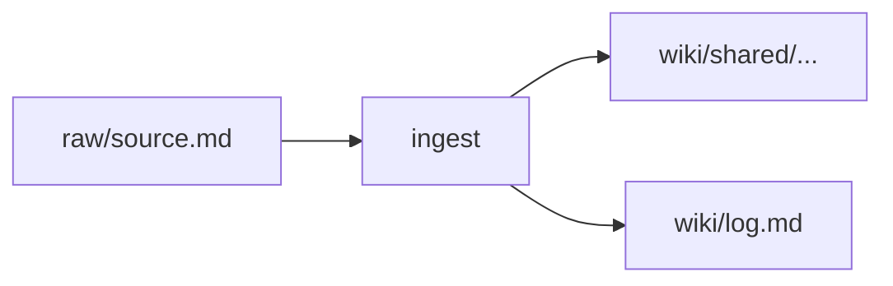

# Obsidian formatting cheat sheet

Reference for Claude when authoring wiki pages. CLAUDE.md §6 covers frontmatter; §6A covers provenance; §7 covers naming. This file covers everything else — the *body* syntax.

This file is in `wiki/meta/` because it's a system doc (like `dashboard.md`), not a content page. It has no frontmatter and is excluded from the wiki schema check by verify-v1.sh.

Linked from:
- CLAUDE.md quick reference card
- `skills/ingest/SKILL.md` — when writing source/entity/concept pages
- `skills/query/SKILL.md` — when filing syntheses
- `skills/triage/SKILL.md` — when promoting inbox items
- `skills/autoresearch/SKILL.md` — when writing research outputs

---

## Links and cross-references

**Wikilinks (always preferred inside the vault).** Use `[[page-name]]` unquoted in markdown body, `"[[page-name]]"` quoted inside YAML frontmatter (YAML otherwise mangles `[[`). This is CLAUDE.md §4 rule 5.

```markdown
See [[andrej-karpathy]] and [[memex]] for context.
```

```yaml
related: ["[[memex]]", "[[llm-wiki-pattern]]"]
```

**Wikilink with display text:** `[[page-name|display text]]` — prefer only when the display text meaningfully differs from the target. Don't use it to "pretty up" a kebab-case slug; that's what the target page's `title` is for.

**Heading anchors:** `[[page-name#Section heading]]` — case and punctuation must match the target heading exactly.

**Block references:** `[[page-name#^block-id]]` — rare. Use only when quoting a specific paragraph that needs to be pinpointed across future edits. Add `^block-id` at the end of the source paragraph, then reference it.

**External links** use standard markdown: `[text](https://url)`. Reserve for citing external sources in the body of a source page. For internal vault navigation, always use wikilinks.

## Embeds

Embeds pull content from another file inline instead of linking to it.

```markdown
![[other-page]]              # embed full page
![[other-page#Section]]      # embed one section
![[image.png]]               # embed image (stored under raw/assets/)
![[diagram.png|300]]         # embed image with width in px
![[paper.pdf#page=3]]        # embed a specific PDF page
```

Use embeds sparingly. They're useful for: pulling a canonical diagram into multiple pages, showing a shared definition in a MOC, or referencing a figure from a raw source. They are **not** a substitute for wikilinks — if the content only needs a pointer, use `[[...]]`.

## Tags

Obsidian also supports inline `#tag` syntax. **This vault uses the `topics:` frontmatter field instead** — `topics` is the structured equivalent and feeds the placement rule and MOC queries. Do not write `#llm-wiki` inline in a page body. If you see one in an older page, surface it as a lint finding rather than silently converting.

The only place inline tags are acceptable is inside a raw source where User tagged his own notes — raw is immutable, leave them alone.

## Callouts

Obsidian renders `> [!type]` blocks as colored admonition boxes. Use sparingly — one or two per page, for content that genuinely interrupts reading flow.

```markdown
> [!note] Optional title
> Body of the callout.

> [!warning]
> Short body on one line.

> [!quote] Source: [[andrej-karpathy]]
> "Maintaining a wiki is the thing LLMs are actually good at."
```

**Types used in this vault:**

- `[!note]` — neutral aside worth flagging
- `[!info]` — background context a reader may want
- `[!quote]` — direct quotation; pair with a source attribution in the title line
- `[!warning]` — content that's fragile, provisional, or contradicts other pages
- `[!gap]` — **this vault's custom convention** (rendered as a generic callout in Obsidian) — marks a claim or section where sourcing is insufficient. Used by `skills/autoresearch/SKILL.md` for open questions.
- `[!example]` — worked examples in skill files (not content pages).

Callouts are collapsible by appending `+` (open) or `-` (closed) to the type: `> [!note]-` starts collapsed.

## MathJax

Inline math: `$E = mc^2$`. Display math:

```markdown
$$
\text{softmax}(x_i) = \frac{e^{x_i}}{\sum_j e^{x_j}}
$$
```

Keep display math in source and concept pages that describe formal definitions (attention, softmax, cross-entropy, etc.). Synthesis pages rarely need math — if a synthesis leans on a formula, link to the concept page that defines it instead of restating the math.

## Mermaid diagrams

Obsidian renders Mermaid inside ```` ```mermaid ```` fences.

```markdown

```

Use cases in this vault: three-layer model diagrams, skill pipelines, entity relationship maps. Keep diagrams small (≤10 nodes) — dense diagrams rot faster than prose. Prefer a short prose description plus a link to a dedicated diagram page over inlining a 20-node Mermaid graph.

## Tables

Standard markdown tables. Alignment markers in the separator row:

```markdown
| Column | Column | Column |
|:---|:---:|---:|
| left | center | right |
| a | b | c |
```

Obsidian supports multi-line cell content with `<br>`. Keep tables narrow enough to read in the reading pane without horizontal scroll. If a table grows past 6 columns, consider restructuring as a list of named records.

## Code blocks

Use fenced code blocks with a language tag for syntax highlighting:

````markdown
```python
def softmax(x):
    ...
```
````

Shell snippets in skill files use `sh` or `bash`. YAML frontmatter examples use `yaml`. Plain prose in a box (no highlighting) uses the blank fence form ```` ``` ```` — reserve this for boxed quotes or ASCII art.

## Headings

- One `#` H1 per page, matching the page `title` in frontmatter.
- Section headings start at `##` and carry `[coverage: ...]` tags where §6A applies.
- Don't skip levels (`##` → `####`).
- Heading text is case-sensitive for wikilink anchors — if you rename a heading, grep for `[[...#Heading text]]` and update references.

## Footnotes

Obsidian supports markdown footnotes:

```markdown
This claim needs sourcing.[^1]

[^1]: Source: [[karpathy-llm-wiki-gist]], section "Pitfalls".
```

Prefer inline citations (`(Source: [[page]])`) in synthesis pages — footnotes are harder to grep and get orphaned by edits. Use footnotes only when a paragraph has 3+ citations that would clutter the prose.

## What to avoid

- **`#tag` inline in content pages** — use `topics:` frontmatter instead.
- **Bare URLs** — always wrap in markdown link syntax or cite via a source page wikilink.
- **Raw HTML** — Obsidian renders some HTML, but it's not portable to other markdown tools. Reach for Mermaid, callouts, or tables first.
- **Emoji in headings** — fine in body prose if User uses them; avoid in headings because heading-based wikilinks break when emoji are involved.
- **Non-breaking spaces and smart quotes** inside code fences — copy-paste from web sources sometimes smuggles these in. If code doesn't parse, check for them.
- **Manual line-wrap inside paragraphs** — Obsidian treats single newlines as line breaks in some themes. Write paragraphs as single long lines; let the editor soft-wrap.
